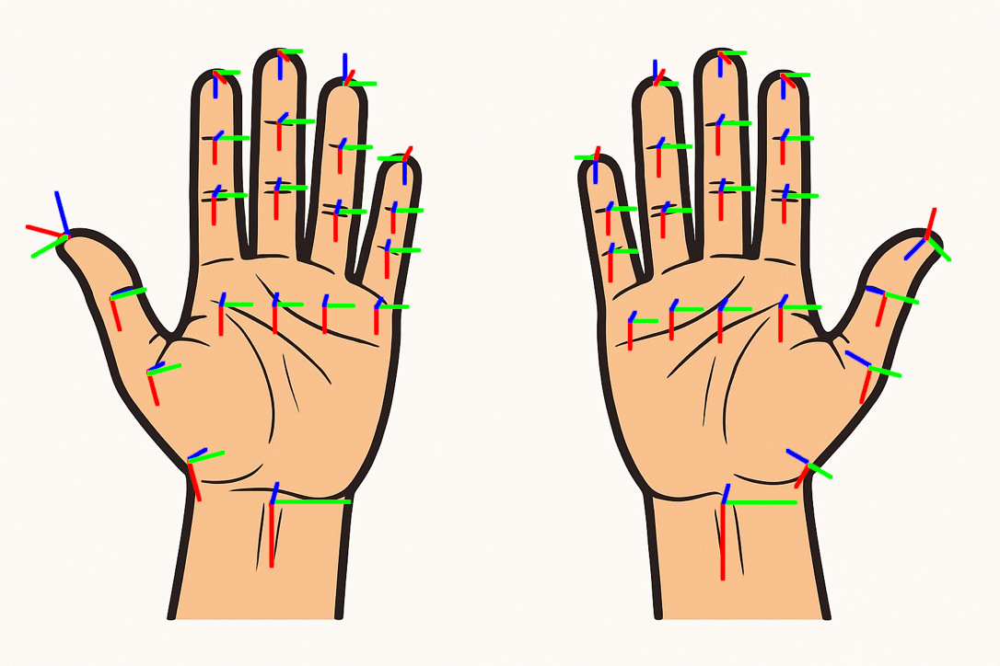

# Spectacles-2-Unitree Coordination Server

Connects Snapchat Spectacles Lens client to a Unitree G1 robot client for real-time XR teleop.

## Usage

### Deployment

#### Coordination Server

Container (AMD64): `docker pull ghcr.io/tastyducks/spectacles-2-unitree-server.server:latest`

Deploy anywhere that hosts containers with a public IP address behind TLS.

> **IMPORTANT**: The server should have the environment variable `DASHBOARD_PASSWORD` set to something with a decent amount of entropy. The default web UI password is `admin`.

#### Unitree G1 Client

Container (ARM64): `docker pull ghcr.io/tastyducks/spectacles-2-unitree-server.client:latest`

There are two ways to run this:

1. **No Unitree G1:** Run the container on your own machine and pass `--mock` as an argument:
   ```bash
   docker run -p 7000:7000 -it ghcr.io/tastyducks/spectacles-2-unitree-server.client:latest --mock --server wss://SERVER_HOST/ws
   ```
   You'll still be able to connect to the client and see the simulated hand tracking.

2. **With a Unitree G1:** Install the [NVIDIA container toolkit](https://docs.nvidia.com/datacenter/cloud-native/container-toolkit/1.17.5/install-guide.html#with-apt-ubuntu-debian) on the robot's NVIDIA Jetson Orin. Then, copy over [run-robot-client.sh](./unitree-client/run-robot-client.sh) and run it.

<br/>

> **IMPORTANT**: To view the simulated images in the Spectacles Lens, open the meshcat UI in your browser after the Unitree client starts: <http://UNITREE_CLIENT_ADDRESS:7000/static/>.

### Development

This repo includes a [devcontainer](https://containers.dev/) that has the Github CLI and `act` (a local Github actions runner) installed.

- Github authentication: To use `act`, you need to authenticate with Github. Run:
  ```bash
  gh auth login -s repo,gist,read:org,write:packages,read:packages,delete:packages
  ```
  The package permissions are needed for `act` to write to the Github package registry.
- Host mounting: the host's Docker socket (on MacOS and Linux) is mounted into the container workspace.

#### Setup

1. Install Docker or a similar container engine like Orbstack. On MacOS with Homebrew:
   ```bash
   brew install docker # or brew install --cask orbstack
   ```
2. If using VS Code, install the [Remote Development extension pack](vscode:extension/ms-vscode-remote.vscode-remote-extensionpack). If you're using Cursor, you can grab that extension by following [these instructions](https://www.cursor.com/en/how-to-install-extension).
3. Reopen this project in a container: <kbd>⌘</kbd>+<kbd>Shift</kbd>+<kbd>P</kbd> -> "Dev Containers: Rebuild and Reopen in Container"
4. Fetch dependencies for the server:
   ```bash
   uv sync
   ```
5. Fetch dependencies for the Unitree G1 client:
   ```bash
   cd unitree-client \
       && source /opt/conda/etc/profile.d/conda.sh \
       && conda activate unitree-client \
       && conda env update -f environment.yml
   ```

Snapchat Spectacles will refuse WebSocket connections on `localhost`, so the server **must** be run at a public IP address with a valid (not self-signed) SSL certificate. I used [Railway](https://railway.com) to automate deployments from the `main` branch while developing.

The Unitree client can be run locally for testing in "mock" mode. This will allow it to run without access to the robot, and will simply print out commands as they are received:
```bash
# Be sure to activate the conda venv first.
cd unitree-client && source /opt/conda/etc/profile.d/conda.sh && conda activate unitree-client \
    && python main.py --mock --server wss://SERVER_HOST/ws
```

#### Troubleshooting

If you see a message like `*** buffer overflow detected ***: terminated`, or `waiting for dds`, it probably means the C++ bindings for the Unitree code are attempting to connect to the robot and failing.

In development (working off the robot), be sure to pass `--mock` when running the Unitree client.

## Architecture

The server uses `aiohttp` and `jinja2` to serve a simple web interface for pairing together Spectacles and Unitree G1 clients on a first-come-first-serve basis and monitoring messages. The dashboard is served at the root `/`, and the WebSocket server is served at `/ws`.

Clients are *not authenticated* and messages are passed transparently between the two clients without modification.

Both the robot client and the Spectacles lens maintain a persistent WebSocket connection to the server.

The Unitree client runs inverse kinematics calculations via [Pinocchio](https://github.com/stack-of-tasks/pinocchio), transforming the Spectacles hand tracking data into the robot's URDF basis.

### Spectacles-space and Unitree-space Transformations

Recorded with [version 0.10.0 of the Spectacles Interaction Kit][SIK-0.10.0]

The **spectacles world basis** is centered on the user's head (X right, Y up, Z back) and uses a right-handed coordinate system.

Reference pose: hold left and right hands in front of the face, palms facing toward the face, and thumbs pointing outward.

- Right vector: Green
- Up vector: Red
- Back vector: Blue



The Spectacles has non-uniform joint bases.
If the entries share a symbol, they use the same basis:

- Left hand:
  | N   | wrist | pinky | ring | middle | index | thumb |
  | --- | ----- | ----- | ---- | ------ | ----- | ----- |
  | 3   |       | P     | R    | M      | M     | A     |
  | 2   |       | X     | X    | X      | X     | J     |
  | 1   |       | X     | X    | X      | X     | J     |
  | 0   | X     | X     | X    | X      | X     | J     |
- Right hand:
  | N   | wrist | thumb | index | middle | ring | pinky |
  | --- | ----- | ----- | ----- | ------ | ---- | ----- |
  | 3   |       | B     | M     | M      | R    | P     |
  | 2   |       | K     | X     | X      | X    | X     |
  | 1   |       | K     | X     | X      | X    | X     |
  | 0   | X     | K     | X     | X      | X    | X     |

For reference, review the Spectacles [landmark names].

#### X
- Hand: left, right
  - Landmarks: wrist, pinky-0, pinky-1, pinky-2, ring-0, ring-1, ring-2, middle-0, middle-1, middle-2, index-0, index-1, index-2
  - X right (index to pinky on the left hand, pinky to index on the right hand)
  - Y up (fingertips to wrist)
  - Z back (palm to back of hand).

**The rest of these are described relative to "X".**

#### P

- Hand: left, right
  - Landmarks: pinky-3
    - X (X.X inverted) (pinky to index on the left hand, index to pinky on the right hand)
    - Y (X.Z) (palm to back of hand)
    - Z (X.Y) (fingertips to wrist)

#### R

- Hand: left, right
  - Landmarks: ring-3
    - X (X.X) (index to pinky on the left hand, pinky to index on the right hand)
    - Y (X.Z) (palm to back of hand)
    - Z (X.Y inverted) (wrist to fingertips)

#### M

- Hand: left, right
  - Landmarks: middle-3
    - X (X.X) (index to pinky on the left hand, pinky to index on the right hand)
    - Y (X.Z inverted) (back of hand to palm)
    - Z (X.Y) (fingertips to wrist)

#### A

- Hand: left
  - Landmarks: thumb-3
    - X ???
    - Y ???
    - Z ???

#### J

- Hand: left
  - Landmarks: thumb-0, thumb-1, thumb-2
    - X ???
    - Y ???
    - Z ???

#### B

- Hand: right
  - Landmarks: thumb-3
    - X ???
    - Y ???
    - Z ???

#### K

- Hand: right
  - Landmarks: thumb-0, thumb-1, thumb-2
    - X ???
    - Y ???
    - Z ???


[landmark names]: https://developers.snap.com/lens-studio/api/lens-scripting/enums/Packages_SpectaclesInteractionKit_Providers_HandInputData_LandmarkNames.LandmarkName.html
[SIK-0.10.0]: https://developers.snap.com/spectacles/spectacles-frameworks/spectacles-interaction-kit/release-notes#v0100