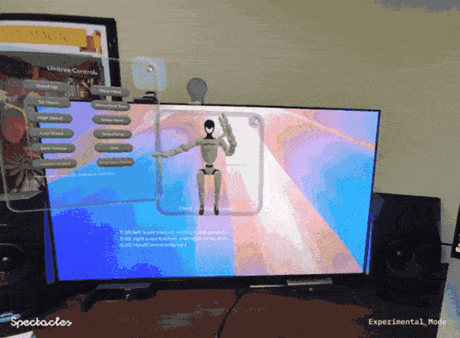

# Spectacles to Unitree Teleoperation

[](https://developers.snap.com/spectacles/about-spectacles-features/apis/gesture-module) [](https://developers.snap.com/spectacles/about-spectacles-features/apis/web-socket) [](https://developers.snap.com/spectacles/spectacles-frameworks/spectacles-interaction-kit/features/overview)



> **IMPORTANT**: This project is provided purely for experimental and research purposes.
We do **not** endorse, sponsor, or have any formal affiliation with Unitree Robotics (or any other company mentioned).
>
> All trademarks, company names, and product names are the property of their respective owners.

## Overview
A system for teleoperating a Unitree G1 humanoid robot using Snapchat Spectacles AR glasses.

**No robot? No problem!** You can still use the simulated hand tracking features with your own Spectacles.

This project provides four main methods of interaction:

1. **Hand Teleoperation**: Control the robot's arms and hands by mirroring your own hand movements, and view a simulated version of the robot in your Spectacles. **Toggle hand tracking by tapping your left palm with your right index finger.**


2. **Preset Actions**: Execute predefined robot actions (stand, sit, wave, etc.) with a single tap.
3. **Virtual Joystick**: Walk the robot around using a virtual joystick.
4. **Raycast movement**: Point to a location and the robot will walk there.

## Contributors

- [Patrick Rose](https://patrickrose.com): *Software developer*
  - Coordination server, Unitree client, Lens hand tracking and teleoperation
- [Vincent Trastour](https://github.com/maisonbleue)
  - Lens raycast component
- [Arthur Baney](https://github.com/azb): *Lightfield Software Engineer at Leia, Mixed Reality Developer. Worked on the Leia Unity Plugin. Creator of Table Soccer, a game published on Meta Quest and Apple Vision Pro.*
  - Lens joystick component
- [Alessio Grancini](https://github.com/alessiograncini): *Developer Experience at Snap*
  - Lens UI components, Lens Studio and SIK API support
- [Vitaly Bulatov](https://github.com/vitl2907)
  - Unitree support and testing

## Usage

> **IMPORTANT:**
> This project uses [Git Large Files Support (LFS)](https://git-lfs.github.com/) to store STL files used for rendering the robot simulation. Downloading a zip file using the green button on GitHub **will not work**. You will need to have Git LFS installed. Once you've cloned the repository, run `git lfs install` and `git lfs pull` to download the URDF meshes.

### Deployment

You will need to be able to build Docker containers. For a tutorial, check out [Docker's official documentation](https://docs.docker.com/get-started/introduction/build-and-push-first-image/). This project also contains [GitHub Action workflows](./.) to automatically build containers and push them to the GitHub Container Registry; if you would like to use them, you will need to copy this project directory into your own repository at the root.

#### Coordination Server

Snapchat Spectacles does not support WebSocket connections on `localhost` at the moment, so the server **must** be run at a public IP address with a valid (not self-signed) SSL certificate. 

Deploy anywhere that hosts containers with a public IP address behind TLS.

> **IMPORTANT**: The server should have the environment variable `DASHBOARD_PASSWORD` set to something with a decent amount of entropy. The default web UI password is `admin` -- change it!

For example, you may use [fly.io](https://fly.io):
```bash
brew install flyctl
cd Spectacles-2-Unitree/coordination-server
cat << EOF > fly.toml
[env]
DASHBOARD_PASSWORD = "A_RANDOM_PASSWORD"
EOF
fly launch
```

#### Spectacles Lens

Open [this project](./Unitree.esproj) in Lens Studio, **version 5.4.1**. In the scene hierarchy, select the `CoordinationClient` component. Then, in the inspector panel, change the Server URL to your host, e.g. `wss://YOUR_SERVER_HOST/ws`.


You may now deploy the Lens to your Spectacles.

#### Unitree G1 Client

There are two ways to run this:

1. **No Unitree G1:** You can still connect to the client and see the simulated hand tracking! Run the container on your own machine and pass `--mock` as an argument:
   ```bash
   docker run -p 7000:7000 -it CONTAINER_URL --mock --server wss://SERVER_HOST/ws
   ```

2. **With a Unitree G1:** Install the [NVIDIA container toolkit](https://docs.nvidia.com/datacenter/cloud-native/container-toolkit/1.17.5/install-guide.html#with-apt-ubuntu-debian) on the robot's NVIDIA Jetson Orin. Then, copy over [run-robot-client.sh](./unitree-client/run-robot-client.sh), **change CONTAINER_URL in the file to your URL**, and run it.

The robot client currently has **two interaction modes** which are mutually exclusive and can be selected by passing the `--mode` argument to the client's container:
1. **Low-level API teleoperation**: `--mode basic_service`: default option. The robot will mirror hand movements, which will be streamed to the Spectacles Lens.
2. **High-level API teleoperation**: `--mode ai_sport`: The robot will be able to walk around and perform discrete actions. These are not rendered in the Spectacles Lens preview.

<br/>

> **IMPORTANT**: To view the simulated images in the Spectacles Lens, open the Meshcat UI in your browser after the Unitree client starts: <http://UNITREE_CLIENT_ADDRESS:7000/static/>.

```stdout
2025-04-19 23:28:26,534 - robot_client - INFO - Initializing arms and hands IK solver...
2025-04-19 23:28:26,535 - robot_client - INFO - Building Pinocchio URDF model from /app/src/ik/urdf/g1/g1_body29_hand14.urdf, meshes from /app/src/ik/urdf/g1
2025-04-19 23:28:41,024 - robot_client - INFO - Casadi: creating model...
2025-04-19 23:28:41,083 - robot_client - INFO - Casadi: creating symbolic variables...
2025-04-19 23:28:41,109 - robot_client - INFO - Casadi: defining error function...
2025-04-19 23:28:41,193 - robot_client - INFO - Casadi: defining optimization problem...
2025-04-19 23:28:41,256 - robot_client - INFO - Casadi: setting optimization constraints and goals...
2025-04-19 23:28:41,295 - robot_client - INFO - Casadi: done
2025-04-19 23:28:41,297 - robot_client - INFO - Setting up Meshcat visualizer...
You can open the visualizer by visiting the following URL:
http://127.0.0.1:7000/static/ # ⚠️ Open this link in your browser
```


### Development

If you'd like to hack on this project, you can open this repository in a [devcontainer](https://containers.dev/) with all dependencies installed. The Github CLI and `act` (a local Github actions runner) are also installed in the container.

You will still need to deploy the coordination server as described above due to the current limitations with the Spectacles Interaction Kit's WebSocket implementation.

Unless otherwise specified, all commands in this section should be run inside the devcontainer.

#### Setup

1. You must have a container engine like Docker Desktop or Orbstack running.
2. If using VS Code, install the [Remote Development extension pack](vscode:extension/ms-vscode-remote.vscode-remote-extensionpack).
3. Open this repository in VS Code, then open the command palette (<kbd>⌘</kbd>+<kbd>Shift</kbd>+<kbd>P</kbd>) and run `> Dev Containers: Rebuild and Reopen in Container`:

  

1. Fetch dependencies for the server:
   ```bash
   cd coordination-server && uv sync
   ```
2. Fetch dependencies for the Unitree client:
   ```bash
   cd unitree-client \
      && source /opt/conda/etc/profile.d/conda.sh \
      && conda activate unitree-client \
      && conda env update -f environment.yml
   ```
3. The Unitree client can be run locally for testing in "mock" mode. This will allow it to run without access to the robot; it will simply print out commands as they are received:
   ```bash
   cd unitree-client && python src/main.py --mock --server wss://SERVER_HOST/ws
   ```

#### Troubleshooting

- If you see a message like `*** buffer overflow detected ***: terminated`, or `waiting for dds`, it probably means the C++ bindings for the Unitree code are attempting to connect to the robot and failing.

  In development (working off the robot), be sure to pass `--mock` when running the Unitree client.

- If the Unitree client becomes unresponsive, you can stop the Docker container by running these commands on the host machine (either your machine or the robot's NVIDIA Jetson, depending on where you are running the client):
  ```bash
  docker ps
  # Read the output and copy the ID of the Unitree client container
  docker stop <CONTAINER ID>
  ```

#### Notes on `act`

- To use `act`, you must first authenticate with Github. Run:
  ```bash
  gh auth login -s repo,gist,read:org,write:packages,read:packages,delete:packages
  ```
  The package permissions are needed for `act` to write to the Github package registry.
- The host's Docker socket (on MacOS and Linux at `/var/run/docker.sock`) is mounted into the container workspace for use with `act`. If your Docker socket is at a different path, you can modify the mount `source` in the [devcontainer.json](./.devcontainer/devcontainer.json) file.

## Architecture

The coordination server uses `aiohttp` and `jinja2` to serve a simple web interface that allows for management of client connections and monitoring messages between them. The dashboard is served at the root `/`, and the WebSocket server is served at `/ws`. Clients are automatically paired on a first-come-first-served basis.

Clients are **not authenticated** and messages are passed transparently between paired clients without modification. If you want to deploy this in a production environment, add client authentication mechanisms.

Both the Unitree client and the Spectacles Lens maintain a persistent WebSocket connection to the server.

The Unitree client runs inverse kinematics calculations via [Pinocchio](https://github.com/stack-of-tasks/pinocchio), transforming the Spectacles hand and head tracking data into the robot's URDF basis.


## Spectacles-space and Unitree-space Transformations

Details on the transformation between the Spectacles and Unitree spaces follow.

Recorded with [version 0.10.0 of the Spectacles Interaction Kit](https://developers.snap.com/spectacles/spectacles-frameworks/spectacles-interaction-kit/release-notes#v0100).

The **Spectacles world basis** is centered on the user's head's initial starting position and uses a right-handed coordinate system. X is right, Y is up, and Z back. Translation is measured in centimeters.

**The Unitree world basis** is centered on the robot's waist and uses a right-handed coordinate system. X is forward, Y is left, and Z is up. Translation is measured in meters.

The Spectacles has non-uniform joint bases.
If the entries share a symbol, they use the same basis:

- Left hand:
  | N   | wrist | pinky | ring | middle | index | thumb |
  | --- | ----- | ----- | ---- | ------ | ----- | ----- |
  | 3   |       | P     | R    | M      | M     | A     |
  | 2   |       | X     | X    | X      | X     | J     |
  | 1   |       | X     | X    | X      | X     | J     |
  | 0   | X     | X     | X    | X      | X     | J     |
- Right hand:
  | N   | wrist | thumb | index | middle | ring | pinky |
  | --- | ----- | ----- | ----- | ------ | ---- | ----- |
  | 3   |       | B     | M     | M      | R    | P     |
  | 2   |       | K     | X     | X      | X    | X     |
  | 1   |       | K     | X     | X      | X    | X     |
  | 0   | X     | K     | X     | X      | X    | X     |

See [SIK landmark names](https://developers.snap.com/lens-studio/api/lens-scripting/enums/Packages_SpectaclesInteractionKit_Providers_HandInputData_LandmarkNames.LandmarkName.html) for more details.


Reference pose: hold left and right hands in front of the face, palms facing toward the face, and thumbs pointing outward.


- Right vector: Green
- Up vector: Red
- Back vector: Blue

The following landmarks are described as transformed relative to the "X" basis.

#### X
- Hand: left, right
  - Landmarks: wrist, pinky-0, pinky-1, pinky-2, ring-0, ring-1, ring-2, middle-0, middle-1, middle-2, index-0, index-1, index-2
  - X right (index to pinky on the left hand, pinky to index on the right hand)
  - Y up (fingertips to wrist)
  - Z back (palm to back of hand).

#### P

- Hand: left, right
  - Landmarks: pinky-3
    - X (X.X inverted) (pinky to index on the left hand, index to pinky on the right hand)
    - Y (X.Z) (palm to back of hand)
    - Z (X.Y) (fingertips to wrist)

#### R

- Hand: left, right
  - Landmarks: ring-3
    - X (X.X) (index to pinky on the left hand, pinky to index on the right hand)
    - Y (X.Z) (palm to back of hand)
    - Z (X.Y inverted) (wrist to fingertips)

#### M

- Hand: left, right
  - Landmarks: middle-3
    - X (X.X) (index to pinky on the left hand, pinky to index on the right hand)
    - Y (X.Z inverted) (back of hand to palm)
    - Z (X.Y) (fingertips to wrist)

#### A

- Hand: left
  - Landmarks: thumb-3
    - X *Unverified*
    - Y *Unverified*
    - Z *Unverified*

#### J

- Hand: left
  - Landmarks: thumb-0, thumb-1, thumb-2
    - X *Unverified*
    - Y *Unverified*
    - Z *Unverified*

#### B

- Hand: right
  - Landmarks: thumb-3
    - X *Unverified*
    - Y *Unverified*
    - Z *Unverified*

#### K

- Hand: right
  - Landmarks: thumb-0, thumb-1, thumb-2
    - X *Unverified*
    - Y *Unverified*
    - Z *Unverified*

#### Spectacles to Dex3 Joint Mapping

 *Image credit: Unitree*

See the [Dex3 user manual](https://marketing.unitree.com/article/en/Dex3-1/User_Manual.html) for more details.

**Dex3 finger targeting is not currently implemented on the Unitree client.**

**Fingertip Reference**

These keypoints are used during Dex3 retargeting.

| Hand  | Spectacles | Unitree Dex3 Name |
| ----- | ---------- | ----------------- |
| Left  | thumb-3    | thumb_tip         |
| Left  | pinky-3    | index_tip         |
| Left  | index-3    | middle_tip        |
| Right | thumb-3    | thumb_tip         |
| Right | index-3    | index_tip         |
| Right | pinky-3    | middle_tip        |

**Joint Reference**

These keypoints are **not used** during retargeting, this is just an "anatomical" reference.

| Hand  | Spectacles | Unitree Dex3 URDF | Unitree Dex3 Joint Name |
| ----- | ---------- | ----------------- | ----------------------- |
| Left  | thumb-0    | left_hand_zero    | thumb_0                 |
| Left  | thumb-1    | left_hand_one     | thumb_1                 |
| Left  | thumb-2    | left_hand_two     | thumb_2                 |
| Left  | pinky-0    | left_hand_three   | index_0                 |
| Left  | pinky-2    | left_hand_four    | index_1                 |
| Left  | index-0    | left_hand_five    | middle_0                |
| Left  | index-2    | left_hand_six     | middle_1                |
| Right | thumb-0    | right_hand_zero   | thumb_0                 |
| Right | thumb-1    | right_hand_one    | thumb_1                 |
| Right | thumb-2    | right_hand_two    | thumb_2                 |
| Right | index-0    | right_hand_three  | index_0                 |
| Right | index-1    | right_hand_four   | index_1                 |
| Right | pinky-0    | right_hand_five   | middle_0                |
| Right | pinky-2    | right_hand_six    | middle_1                |

## Licensing

This project is provided under the [MIT license](./LICENSE).

See [ATTRIBUTION.md](./ATTRIBUTION.md) for third-party licenses.
